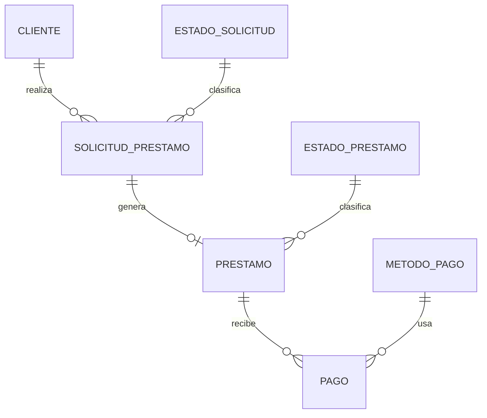

# Documentación — Sistema de Gestión de Préstamos Bancarios (CHN)

Documento único con lo esencial del diseño y la solución. Para **ejecutar** el sistema, ver el
[README raíz](../README.md). Los diagramas en detalle e imprimibles están como PDF en esta carpeta
(`Casos de Uso`, `Procesos`, `Entidad Relacion`) y el enunciado en `ExamenPracticoProgramador.pdf`.

---

## 1. Resumen

Sistema web para gestionar préstamos bancarios de extremo a extremo: **clientes**, **solicitudes**
(con aprobación/rechazo), **préstamos aprobados** y **pagos** con cálculo de **saldo pendiente**.

- **Backend:** Spring Boot 3 (Java 21), SQL Server (T‑SQL) + Flyway, seguridad JWT.
- **Frontend:** Angular 18 + Tailwind (SPA).
- **Despliegue:** `docker compose up --build` levanta base de datos + backend + frontend.

## 2. Roles y seguridad

Autenticación **JWT stateless**; autorización por **matriz de permisos** (`modulo.accion`) resuelta de
forma declarativa con `@RequierePermiso` + un aspecto AOP. Los permisos efectivos = permisos del rol
**menos** los revocados por usuario **más** las excepciones otorgadas (`granted`).

| Rol | Puede |
|-----|-------|
| **Operador** | Gestionar clientes, registrar/aprobar/rechazar solicitudes, registrar pagos, consultar saldos |
| **Cliente** (autoservicio) | Ver/crear **sus** solicitudes, ver **sus** préstamos y saldos, actualizar **su** contacto (correo/teléfono/dirección) |
| **Administrador** | Gestionar usuarios, roles, matriz rol‑permiso y excepciones por usuario |

**Aislamiento horizontal:** un Cliente solo accede a sus propios datos (protección anti‑IDOR), además del
control por permiso.

## 3. Casos de uso principales

- **Clientes:** registrar, listar/buscar (por id o identificación), editar, dar de baja (soft delete).
- **Solicitudes:** solicitar préstamo (monto, plazo, propósito); listar por cliente con su estado;
  **aprobar/rechazar** registrando el motivo (máquina de estados: solo desde `EN_PROCESO`).
- **Préstamos y pagos:** listar préstamos por cliente con su estado; **registrar pagos** en efectivo;
  **calcular y mostrar el saldo pendiente** (y su conciliación + historial de pagos).

## 4. Modelo de datos (núcleo de negocio)

- Una **solicitud** aprobada genera **un préstamo** (1:1); cada préstamo recibe **muchos pagos**.
- Estados como **catálogos** (no enums fijos) → escalable sin tocar código.
- Seguridad: `USUARIO`–`ROL`–`PERMISO` (matriz) con `USUARIO_PERMISO.granted` para excepciones.
- Las columnas `usuario_*_id` son **referencias de auditoría** (quién registró/resolvió/dio de baja), no
  asociaciones de dominio.

## 5. Arquitectura

- **Estilo:** monolito modular, **en capas** (`web → service → repository → domain`), organizado por
  *feature* (`cliente`, `prestamo`, `pago`, `security`, `common`); API REST *stateless*.
- **Patrones de arquitectura:** MVC, Inyección de dependencias/IoC, **DTO**, **Repository/DAO**,
  **Access Token (JWT)**, **RBAC**.
- **Patrones de diseño:** Strategy (`PasswordEncoder`), Template Method (`OncePerRequestFilter`),
  AOP/Interceptor (`@RequierePermiso`), Factory Method (creación del préstamo), Layer Supertype
  (`@MappedSuperclass`), Cadena de filtros de Spring Security, Singleton (beans), Builder (JWT/Flyway).

## 6. POO y SOLID

Cumple los cuatro pilares y los cinco principios, con evidencia:

- **Abstracción/Herencia:** `EntidadAuditable` y `Catalogo` (`@MappedSuperclass`) reutilizadas por
  entidades y catálogos.
- **Encapsulamiento:** modelo rico — la baja solo por `darDeBaja(...)` (sin setters de la invariante);
  reglas de estado en la entidad (`estaEnProceso`, `estaVigente`).
- **Polimorfismo:** subtipos (repositorios, `PasswordEncoder`), genéricos, despacho de excepciones.
- **SRP/OCP/LSP/ISP/DIP:** capas por feature; catálogos y permisos *data‑driven* (extender sin tocar
  código); subclases sustituibles; repositorios pequeños por agregado; inyección por constructor.

## 7. Normalización

Esquema en **3FN/BCNF**. Las únicas “denormalizaciones” son **deliberadas** y justificadas:
- `saldo_pendiente` **materializado** (rendimiento + bloqueo optimista) — reconciliable desde los pagos.
- `permiso.codigo` (`modulo.accion`) por practicidad de autorización.

## 8. Decisiones de diseño confirmadas

- **Soft delete** en todo: nunca borrado físico (auditoría bancaria); se marca inactivo + sello de baja.
- **Sin cálculo de intereses** (no está en el enunciado), pero el modelo es **escalable** (`tasa_interes`,
  `monto_total`, tabla `cuota_prestamo`).
- **Saldo materializado + bloqueo optimista** (`@Version`): registro de pago atómico; pagos concurrentes
  resueltos con reintento (409). Comparaciones monetarias con `BigDecimal.compareTo`.

## 9. Pruebas (representativas)

- **Camino feliz:** crear cliente → solicitar → aprobar (crea préstamo `VIGENTE`) → pagar parcial → pagar
  resto (pasa a `PAGADO`) → saldo conciliado en 0.
- **Borde/negativos:** identificación duplicada → 409; monto/plazo inválidos → 400; aprobar una solicitud
  ya resuelta → 409; pago mayor al saldo → 422; pago sobre préstamo `PAGADO` → 409; recurso inexistente → 404.
- **Seguridad:** sin token → 401; sin permiso → 403; acceso a datos de otro cliente → 403.

## 10. Riesgos y mitigaciones (principales)

| Riesgo | Mitigación |
|--------|-----------|
| Imprecisión monetaria | `BigDecimal` + `DECIMAL(19,2)`; comparaciones con `compareTo` |
| Pérdida de auditoría | **Soft delete** (sin borrado físico), sello de baja, historial de estados |
| Pagos concurrentes | `@Transactional` + bloqueo optimista (`@Version`) → 409 + reintento |
| Escalamiento de privilegios / IDOR | `@RequierePermiso` por endpoint + aislamiento por `clienteId` del token |
| Despliegue reproducible | Flyway (script versionado) + `docker compose` con un comando |

## 11. Evolución propuesta (no implementada)

- **Auditoría centralizada** *append‑only* (`evento_auditoria`) con rol **AUDITOR** de solo lectura.
- **Separación en múltiples bases** (Seguridad / Negocio / Auditoría) mediante referencias lógicas.
